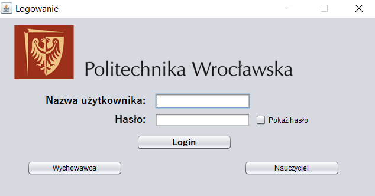
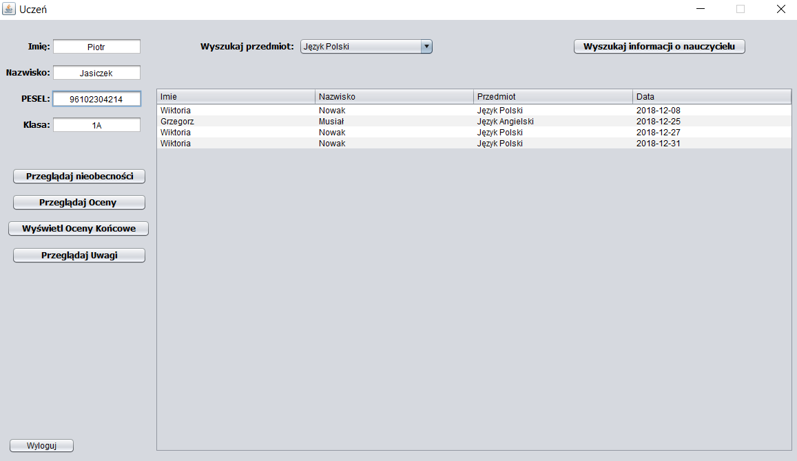
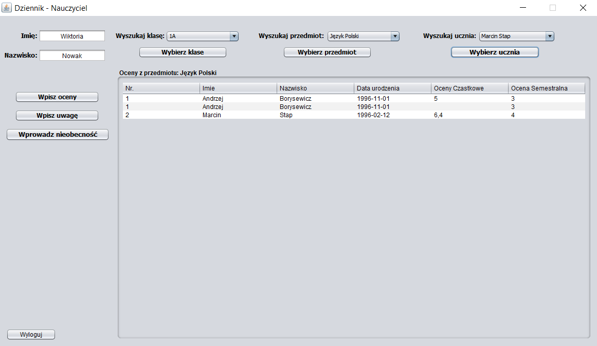
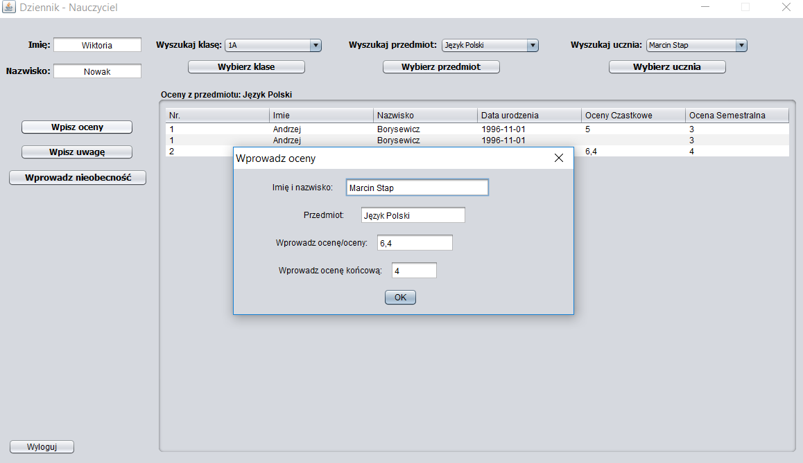
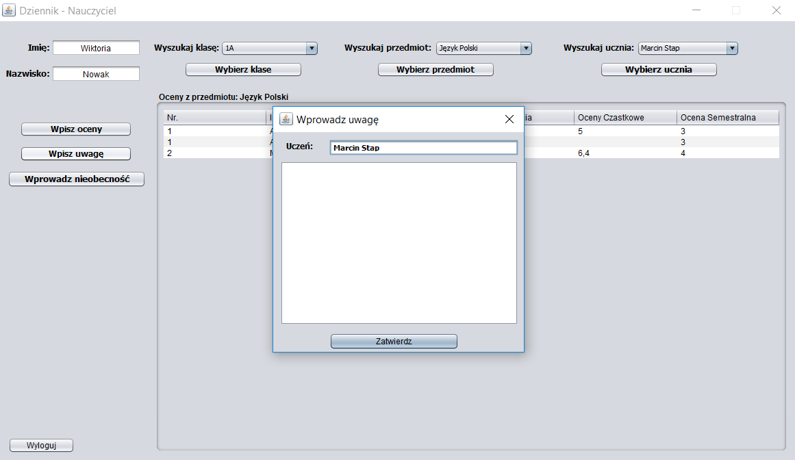

# School Register
> This repository contains code from the app, which has the function of a school journal for students, parents, teachers and educators.

## Table of contents
* [General info](#general-info)
* [Screenshots](#screenshots)
* [Setup](#setup)
* [Features](#features)
* [Status](#status)
* [Contact](#contact)

## General info
Electronic school register application created for the needs of laboratory classes.

## Screenshots

## Setup
To connect to the database from java application, we need to add a jar library to the project named:
* _mysql-connector-java-8.0.13_

The second library located in the _/resources_ directory is responsible for things related to the table located in the main application window. This jar library called:
* _rs2xml_

## Features
To-do list:
* Add more functionality for the pupils, teacher and educator,
* Make functionality for the administrator.

## Status
Project is: _in progress_.

## Contact
Created by [@PJasiczek](https://www.piotrjasiczek.pl/) - feel free to contact me!
